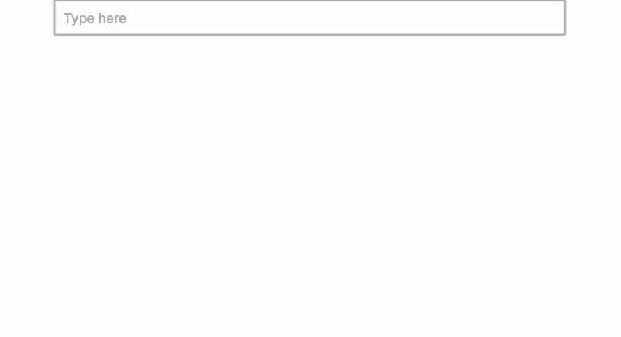

# React d3 enter/exit animations



This is a proof of concept implementation of declarative enter-update-exit
transitions built with React and d3js.

The main `FancyText` component's render method is completely
declarative. It renders `Letter`s using a naive loop.

```javascript
    render() {
        let transform = `translate(${this.props.x}, ${this.props.y})`;

        return (
            <g transform={transform}>
                <ReactTransitionGroup component="g">
                    {this.state.alphabet.map((d, i) => (
                        <Letter d={d} i={i} key={`letter-${d}`} />
                     ))}
                </ReactTransitionGroup>
            </g>
        );
    }
```

Each `Letter` component then uses lifecycle hooks from
`ReactTransitionGroup` to do transitions.

```javascript
class Letter extends Component {
    state = {
        y: -60,
        className: 'enter',
        fillOpacity: 1e-6
    }

    componentWillEnter(callback) {
        // start enter transition, then callback()
    }

    componentWillLeave(callback) {
        // start exit transition, then callback()
    }

    componentWillReceiveProps(nextProps) {
        if (this.props.i != nextProps.i) {
            // start update transition
        }
    }

    render() {
        return (
            <text dy=".35em"
                  y={this.state.y}
                  x={this.state.x}
                  className={this.state.className}
                  style={{fillOpacity: this.state.fillOpacity}}>
                {this.props.d}
            </text>
        );
    }
};

```

Based on Mike Bostock's
[General Update Pattern 4.0](https://bl.ocks.org/mbostock/a8a5baa4c4a470cda598)
block.

## License

CC0 (public domain)
